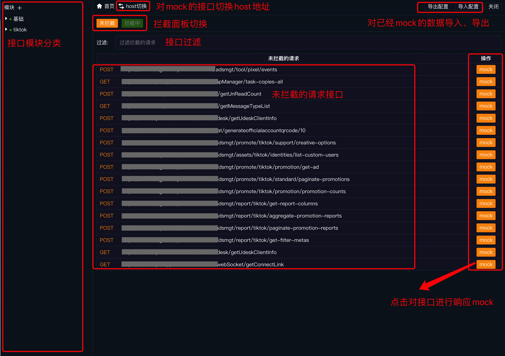
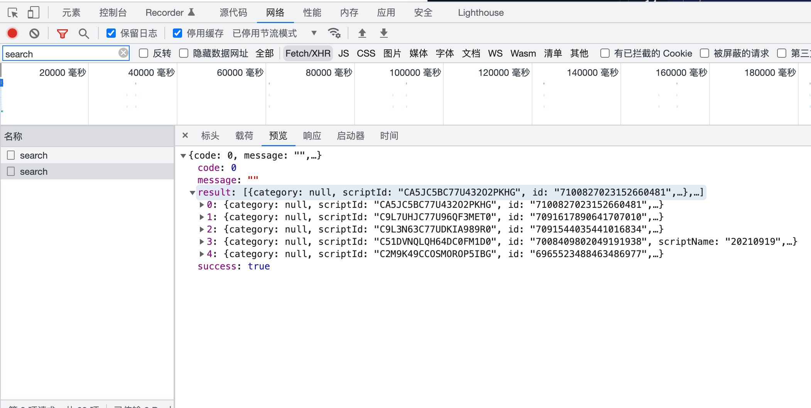
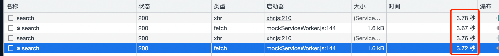
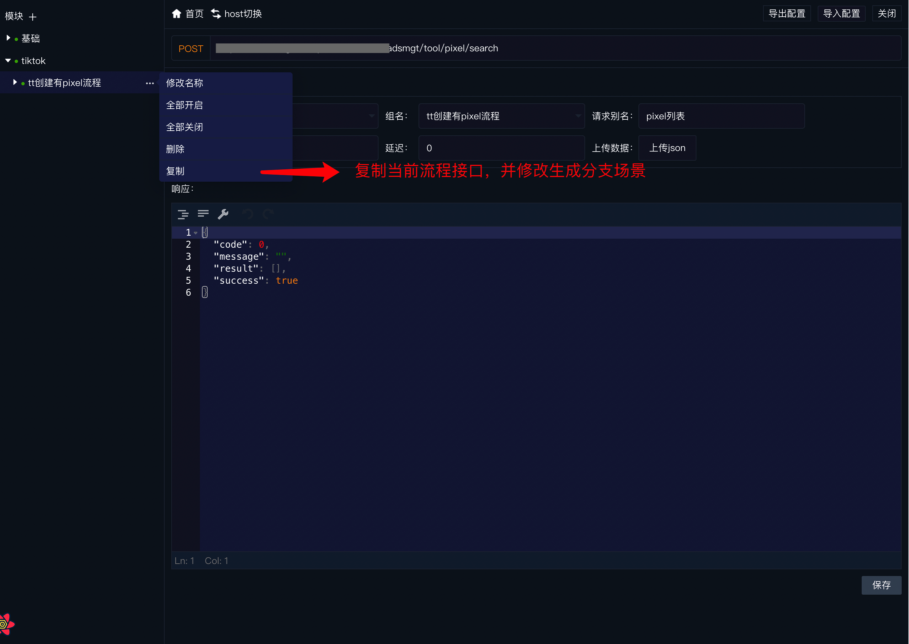
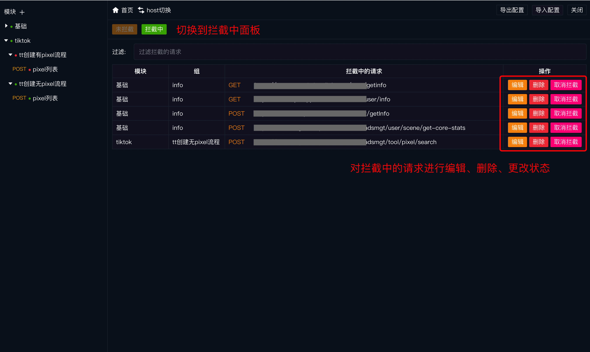
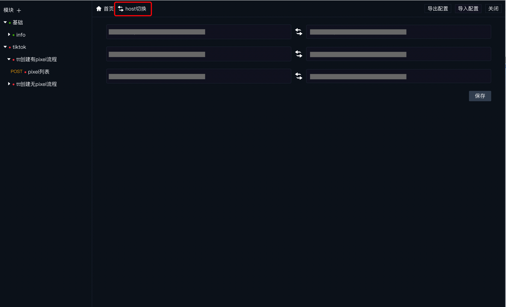
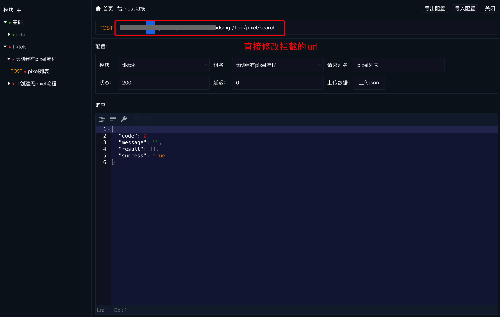

# msw-tools
msw-tool 是基于msw(Mock Service Worker)而开发的插件，旨在提高开发效率，不侵入业务代码，方便多分支业务场景灵活切换，通过msw 提供的api，监听所有请求的接口，并能够获取已经响应的接口数据，开发者能够即时修改任何响应数据，即时生效

# 使用
- 安装msw-tool
	- yarn add @sino/msw-tool --dev
- 执行msw初始化([文档](https://mswjs.io/docs/getting-started/integrate/browser)),PUBLIC_DIR 为public文件夹路径，目的是将worker的js代码放到public文件夹下面
  - npx msw init <PUBLIC_DIR> --save （umi项目需要新建public目录）
  - 在开发模式下引入
    ```
    //在create-react-app中
    import { MswUi } from "@sino/msw-tool";
    ......
    ......
    //projectName为项目名称，作为存储唯一key
    ReactDOM.render(
      <MswUi projectName="creation_front">
        <AppProvider>
          <App />
        </AppProvider>
      </MswUi>,
      document.getElementById('root')
    );
    ```
    ```
    //在umi中
    //app.tsx
    import { MswUi } from '@sino/msw-tool';

    export function rootContainer(container) {
      return <MswUi projectName="creation_front">{container}</MswUi>;
    }
    ```
# 实际应用
1. 页面介绍

2. 选择一个接口进行mock （对于第三方接口，有时响应比较慢，导致在走流程的时候耗时较长，即时mock很大程度上可以提高流程调试效率）


- mock前获取tiktok pixel列表耗时

- mock后获取tiktok pixel列表耗时

3. 拦截并修改响应数据


4. 创建业务分支流程
- 对于多分支流程，可以创建多个分支接口组，在开发过程中灵活切换。



5. mock状态管理

6. 接口host切换
- 批量切换：

- 单个切换：


7. 关于https，需要注意的事项
https证书无效的时候，msw是无法拦截请求的，具体可以查看https://mswjs.io/docs/recipes/using-local-https
8. 关于Create React App (version 3)
   - 如果使用的是Create-React-App v3版本创建的项目，需要删除以下代码
      ```
      // src/index.js
      // Create-React-App v3版本创建的会默认去掉所有service的注册，这样会导致工具无效
      serviceWorker.unregister()
      ```
